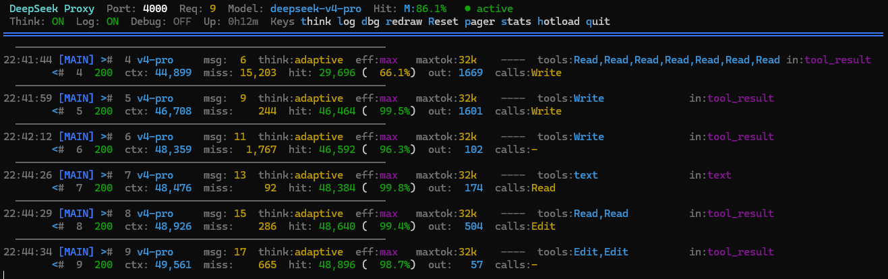

# DeepSeek Cache-Safe Proxy

一个零依赖的 Node.js HTTP 代理，部署在 Claude Code VS Code 扩展与 DeepSeek API 之间。在终端 TUI 中实时检查、显示和记录 API 流量，同时转发请求——支持可选的子代理思考配置覆盖。


<br>🌐 [English Docs](README.md)



## 功能特性

- **实时 TUI** — 实时状态栏，显示端口、请求数、模型、会话徽章（项目路径、应用类型、Git 状态）、独立 MAIN/SUB 缓存命中率、开关状态（含调试 TUI 打印）、运行时间和快捷键。彩色请求/响应行，列对齐。
- **会话元数据** — 从系统提示和请求头中提取项目目录、应用类型（`[vscode]` / `[cli]`）和 Git 仓库状态。以紧凑徽章形式显示在状态栏中。
- **子代理思考覆盖** — 自动将主代理的 `thinking` 和 `output_config` 注入子代理请求，使子代理继承主会话的推理预算。一键切换开/关。
- **CSV 指标记录** — 每次请求记录 token 使用量（输入、缓存命中、输出、推理）、模型信息、思考配置、工具调用等。异步、非阻塞写入。
- **压缩响应支持** — 在指标提取前透明解压 gzip/deflate/brotli 响应（DeepSeek 对 `think:none` 请求使用）。
- **独立缓存追踪** — MAIN 和 SUB 缓存命中率按会话独立追踪（它们拥有完全独立的上下文缓存）。
- **调试日志** — `d` 启用全面调试输出到 `proxy-debug.log`。`D`（Shift+D）独立切换 TUI 中调试行的显示。
- **热重载** — 无需重启进程即可重载所有 `lib/*` 模块。日志缓冲区、会话统计和终端状态得以保留。
- **翻页模式** — 冻结日志并通过类 vim 按键（`j`/`k`、`g`/`G`、`PgUp`/`PgDn`）滚动历史记录。状态栏保持实时更新。
- **会话检测** — 自动检测 API 密钥变更，创建独立的会话桶及缓存追踪。

## 快速开始

```bash
# 启动代理（默认端口 4000）
node proxy.js

# 自定义端口
$env:PROXY_PORT=3000; node proxy.js   # PowerShell
PROXY_PORT=3000 node proxy.js         # bash
```

然后将 Claude Code 配置为使用 `http://localhost:4000` 作为 API 端点。

## 环境变量

| 变量 | 默认值 | 说明 |
|---|---|---|
| `PROXY_PORT` | `4000` | 监听端口 |
| `DEEPSEEK_HOST` | `api.deepseek.com` | 上游 API 主机 |
| `PROXY_LOG_FILE` | `./proxy-metrics.csv` | CSV 输出路径 |
| `PROXY_MAX_BODY` | `52428800`（50 MB） | 最大请求体大小 |
| `PROXY_REQ_TIMEOUT` | `120000`（120秒） | 出站请求超时 |
| `PROXY_SRV_TIMEOUT` | `130000`（130秒） | 入站/服务器超时 |

## 架构

```
proxy.js ── 编排器（HTTP 服务器、转发、键盘输入）
  ├── lib/config.js    — 常量、环境变量覆盖、CSV 表头
  ├── lib/colors.js    — ANSI 转义码、日志标签、格式化工具
  ├── lib/tui.js       — 终端 UI：状态栏、翻页/回滚、会话/缓存统计、节流重绘
  ├── lib/inspector.js — 解析 Claude API JSON 负载，提取模型/思考/工具信息
  └── lib/metrics.js   — 从流式响应缓冲区提取 token 用量，写入 CSV
输出文件：
  ├── proxy-metrics.csv  — 每次请求的 token 指标
  └── proxy-debug.log    — 完整调试输出（调试模式开启时）
```

**请求流程：** 客户端 → HTTP 服务器 → 带大小限制的请求体读取 → JSON 解析 → 负载检查 + 会话元数据提取（项目目录、应用类型、Git 状态）→ 会话激活（通过 auth 头指纹）→ 子代理思考覆盖（如适用）→ 通过 HTTPS keep-alive 转发至 DeepSeek → 流式响应 → gzip 解压（如已压缩）→ 从尾部缓冲区提取指标 → TUI 日志 + 按会话的缓存统计 + CSV 追加 + 调试文件日志。

## HTTP 端点

| 方法 | 路径 | 说明 |
|---|---|---|
| `POST` | `/*` | 转发至 DeepSeek（需要 JSON 请求体） |
| `GET` | `/toggle` | 切换子代理思考覆盖 |
| `GET` | `/toggle-log` | 切换 CSV 文件记录 |
| `GET` | `/toggle-debug` | 切换调试日志 |
| `GET` | `/health` | 健康检查（运行时间、请求数、开关状态） |
| `GET` | `/status` | 简要状态（开关 + 请求数） |
| `GET` | `/metrics` | 下载 CSV 日志（如文件记录关闭则返回 503） |

## 键盘控制

| 按键 | 操作 |
|---|---|
| `t` | 切换子代理思考覆盖 |
| `l` | 切换 CSV 文件记录 |
| `d` | 切换调试日志（文件始终记录，TUI 默认关闭） |
| `D` | 切换调试 TUI 打印（仅在调试模式开启时可用） |
| `r` | 刷新屏幕 |
| `R` | 重置 MAIN 缓存统计（不重载） |
| `p` | 进入/退出翻页模式（回滚） |
| `s` | 打印统计行到日志 |
| `h` | 重置 MAIN 统计 + 热重载所有 `lib/*` 模块 |
| `q` | 退出 |

### 翻页模式按键

| 按键 | 操作 |
|---|---|
| `j` / `↓` | 向下滚动一行 |
| `k` / `↑` | 向上滚动一行 |
| `PageUp` | 向上滚动十行 |
| `PageDown` | 向下滚动十行 |
| `g` | 跳转到日志缓冲区顶部 |
| `G` | 跳转到底部（恢复跟随） |
| `p` / `q` / `Esc` | 退出翻页模式，返回跟随模式 |

## CSV 输出

每次请求在 CSV 日志中追加一行。列说明：

`timestamp, role, agentId, model, thinkingType, thinkingBudget, maxTokens, msgCount, systemLen, lastTools, lastUserHint, callTools, missTokens, cacheHitTokens, cacheHitPct, outputTokens, reasoningTokens`

- **role** — `MAIN`（主代理）或 `SUB`（子代理）
- **agentId** — 代理 ID 的前 8 个字符
- **cacheHitPct** — 本次请求的缓存命中率
- **reasoningTokens** — DeepSeek 推理 token（思维链）

## 环境要求

- Node.js ≥ 18
- 无 npm 依赖 — 仅使用 `http`、`https`、`fs`、`readline`、`zlib` 内置模块
- 支持 ANSI 的终端（Windows 10 1511+、macOS、Linux）

## 许可证

MIT
